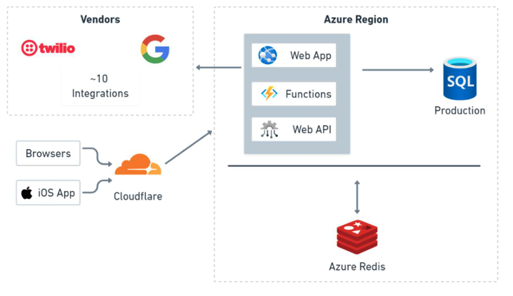
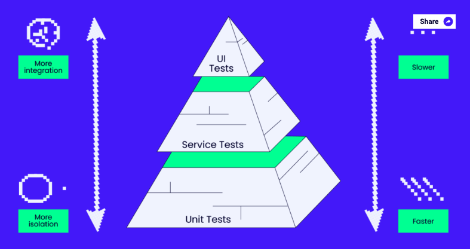

# evercommerceTechnicalTest
- [evercommerceTechnicalTest](#evercommercetechnicaltest)
- [introduction](#introduction)
- [The My Bookings App Webapp](#the-my-bookings-app-webapp)
- [Trainning](#trainning)
- [Excerise One](#excerise-one)
- [Excerise Two](#excerise-two)
- [My advice](#my-advice)


# introduction

  This is my breakdown on the EverCommerce Technical test, my answers are based on the information provided to me in the Lead Test Automation Engineer - Technical Excerise provided to me.

# The My Bookings App Webapp

The web app is a React FrontEnd build on a .NET 6+ Web backend with SQL Server database.
The diagram below highlights all the integration point within the application.



For the tools/library I suggest that can be use to test the My Bookings App are the following:

* [Playwright](https://playwright.dev/): Its UI Automation test framework that provide easier support for UI e2e tests and the abilities to run against multiple borwsers, OSs, on CI, and headless or headed.
* [Mailosaur](https://mailosaur.com/): Its a paid service that can integrate wtih Playwright that provides the ability to test SMS and Email notification (note: I haven't used this service before, but it sound a possible good solution to tests that bit of the system)
* [Gmail NodeJS](https://developers.google.com/gmail/api/quickstart/nodejs): This is another solution to enable us to test email notification (I have used this in previous project).
* [Azure NodeJS](https://learn.microsoft.com/en-us/azure/developer/javascript/core/use-azure-sdk): I haven't used Azure for quite sometime, but I have used some part of the NodeJS library to test some of the Azure system in previous project, for this exercise, I believe we might be able to use it to access the SQL DB.
* WebAPI service: We can use the Web API tests to manipulate data or verify if the data stored in the DB.

# Trainning

To provide reading or training materials for understanding the project, I will suggests

* [Playwright](https://playwright.dev/): Playwright have got a great reference documentation and I would recommend any begginer before delving into understanding this project, is have a read and play first with the [Playwright CodeGen](https://playwright.dev/docs/codegen), this will give them a great way to understand the basic and record the test flow they want to build.
* [Playwright POM](https://playwright.dev/docs/pom): To understand the reasons and basic of why we follow the Page Object Model, when designing any UI Automation test.

# Excerise One

The Project breakdown is as follow:
```
- report
- support
-- functions (this will contain all thrid parties libraries, like Mailosaur, Gmail, AZUREs)
-- Page Object Model (this will contains all the Page Object models for the web app pages, elements, functionalities)
-- Web Api (possible integration with the Web API services with the tests)
- test 
-- Feature (for example Login, and each feature folder, will contains the basic, alternative, and error flows. Its better to breakdown the tests into small test files, else it will be hard to follow and read)
```
Please refer to each file, there are discription of what each file does and possible functionalities and test scenarios for each feature.


# Excerise Two

To answer this questions, I usually build a guideline that we need to fllow:

* Any new Test, need a code Pull Request review to understand the changes and the impact on the new and existing tests.
* Make sure no flakiness introduced when adding new tests.
* Have daily runs of tests, after Product feature merged to master and deployed on test enviroment and compare the results with previous runs. To understand if its a code or test issue.
* Define some Dev/QA practice, as one of the most popular flakiness issue, that UI elements and test ids are removed wtihout a clear communication with the QA. This need to be raised and communicate during sprint planning or sprint grooming sessions.
* Understand what any new feature build, might introduce to our system. For example, we added another API call that might effect the speed of sending an sms or email notification. Which might, effect our polling await to see if either SMS or email notification recieved within our agreed margin. (example, with Accordo, we had an email notification process, we had an agreed margin for the await, but everytime some new feature got added, it caused the tests to be flaky, that mainly becaues its the system. We disccussed with our Teac lead and had to agree on the an agreed time we can't break).
* Communication, have always been the main challenge and adding a new process or practice to a company is always a challenge. We have to agree on a middle line that we all must agree.

Even with guidelines, it usually get missed, my approach is mainly understand the issue of the feature and match it with how the test and the framework was built. Because, what was written yesterday, might not be ideal for tomorrow's solution. That is a similar approach with the features we are building based on the technologies we use. 
  

# My advice

* I usually perfer to follow the test Pyramid when desiging any type of Automation Test framework
  I would recommend breakdown the UI tests to focus mainly on User Journey and not on how an element in the UI looks like. We can use other tools like 
    * [Storybook](https://storybook.js.org/): Found this useful and was introduced by one of the UI Tech lead in previous roles
    * [React testing tool](https://testing-library.com/docs/react-testing-library/intro/): I haven't used it but developer teams did use it in previous roles.
  [theqalead](https://theqalead.com/topics/testing-pyramid/)

* More API integration tests over UI, as they will be faster and give us results as early as possible. This will help isolate any major feature functionality before hitting the UI, and isolate the issuer in service layer than UI layer. 


